# Readme for the Project
### Versions being used are
- Utilizing ruby 3.2.7 (2025-02-04 revision 02ec315244) [x64-mingw-ucrt]
- MongoDB 8.0
- gem "rails", "~> 8.0.1"
- gem 'mongoid', '~> 8.0'
- gem "puma", ">= 5.0"

  
# Extract/Transform in python

### S3 bucket credentials:
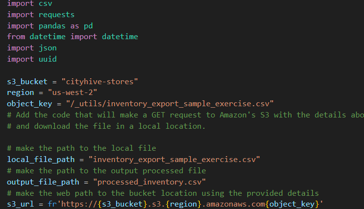

### Pull in data using credentials:
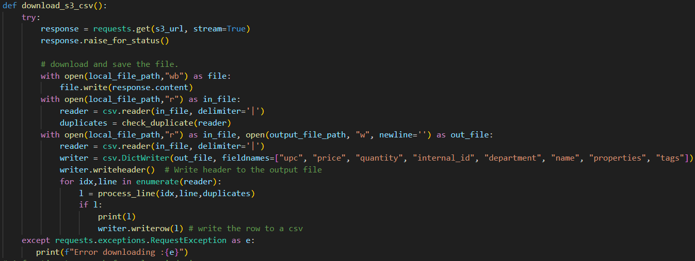

### This will write/update the csv file:
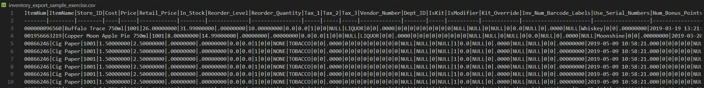

### Final output of Python w/o Ruby
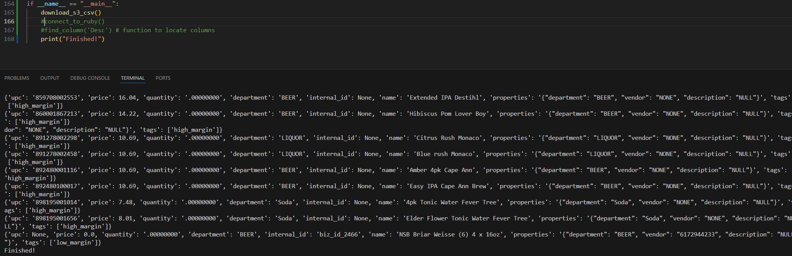

### Where the final value being return is made with this part of the code:
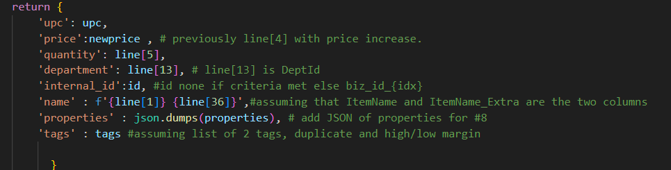

### Then the final CSV is here, which can be turned into json/xls/etc.
### Note: That once the Ruby Project is complete this section may change
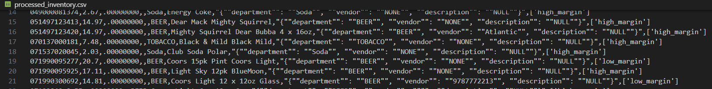

# Ruby project located in inventory_api folder of project:

## Inventory API Important files are:

### - inventory_api/Gemfile
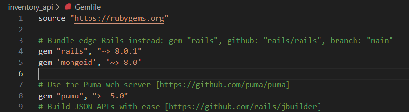

### - inventory_api/app/controllers/inventory_uploads_controller.rb
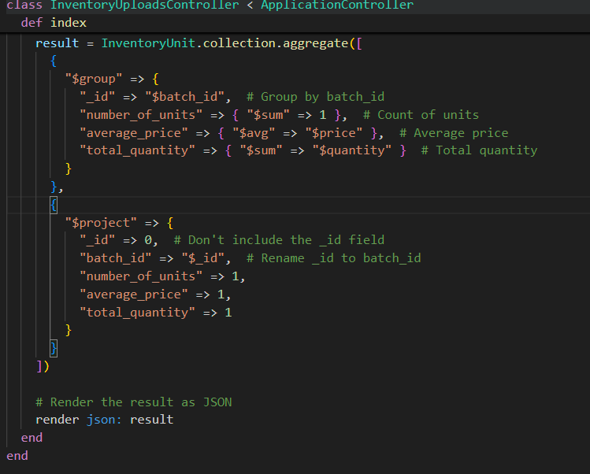

### inventory_api/app/models/inventory_unit.rb
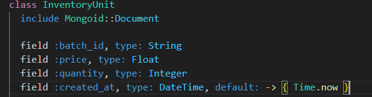

# After setting up Mongodb/Ruby 
### Type rails server
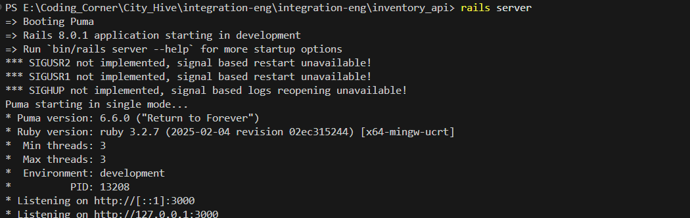

### Then you should be able to find server at listen location:
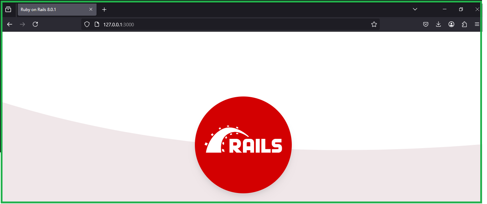

### Then setup the Post/Get Command and the model & controller will output the data here 
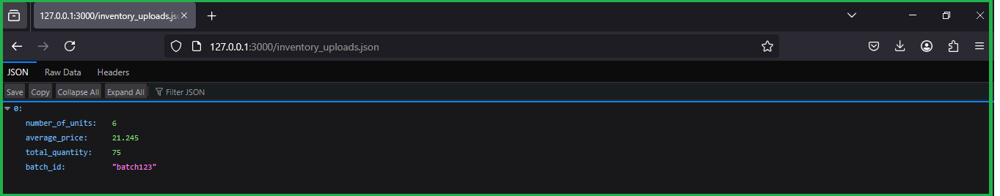

# Last step integrate python 

### Create a generate(), upload(), list_uploads(), and main() script, then run each as an action of main() below:
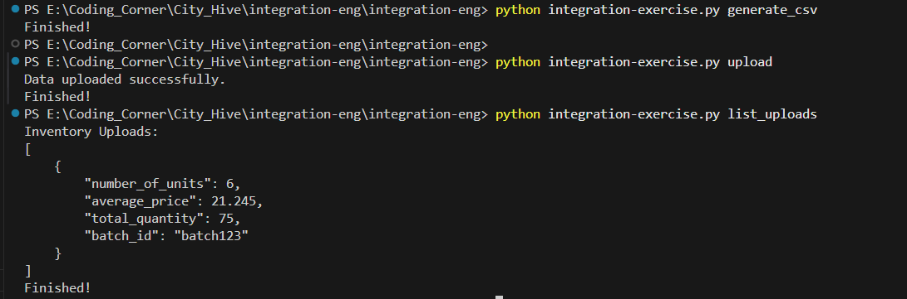

### Kill the ruby/mongodb instances after complete
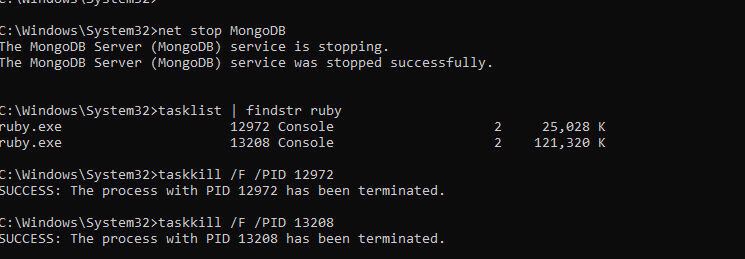
